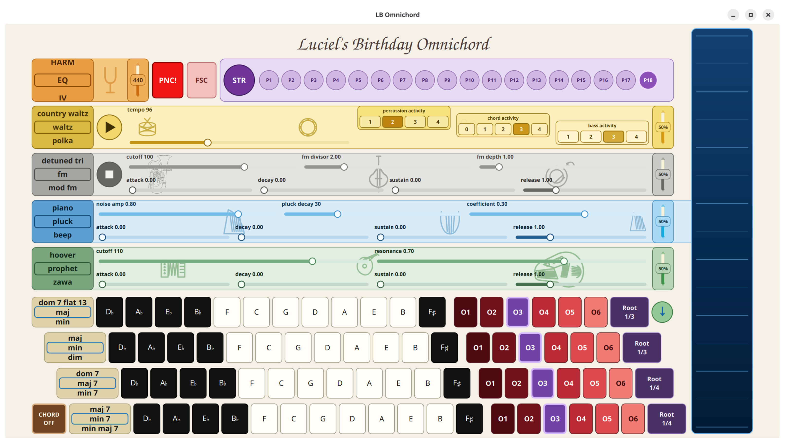

# LB_Omnichord

**Luciel's Birthday Omnichord** is a touchscreen chord instrument built around Sonic Pi, a Qt Quick/PySide6 user interface and OSC.



It started from the basic Omnichord idea: one hand selects chords, the other hand plays or strums over them. I did not try to make an exact software copy of a particular Suzuki Omnichord. The useful part of the concept is the separation between chord selection and the strum surface, and from there the instrument grew into something with its own synths, bass, rhythm section, presets and tuning systems.

This version was made as a birthday gift for Luciel.

The design is deliberately split in two:

```text
Qt Quick / Python
    touch UI
    chord and preset state
    synth/rhythm configuration
    tuning calculations
           |
           | OSC, normally localhost:4560
           v
Sonic Pi
    synths
    samples
    timing
    sustained/manual chord voices
    rhythm + chord + bass scheduling
```

Keeping the UI and audio engine separate turned out to be useful. Sonic Pi remains Sonic Pi; the Qt application does not embed it or import its Ruby code.

## Main features

The instrument currently has:

- four independent chord rows;
- 12 root buttons in the Omnichord-like order `Db Ab Eb Bb F C G D A E B F#`;
- 36 chord types, selected independently per row;
- octave selection `O1` through `O6` per chord row;
- chord inversions per row;
- immediate multi-touch chord playing;
- automatic suppression of rhythm chords while a manual chord is held, so the accompaniment does not fight the player;
- a seven-octave strum range, `C1` through `B7`;
- tap or drag playing on the strum surface;
- separate chord, strum and bass synth engines;
- 27 Sonic Pi synths with editable parameters;
- independent chord, strum, bass and percussion volume;
- a copy button which copies the complete strum synth setup and volume to the chord synth;
- 54 editable rhythms;
- tempo from 40 to 200 BPM;
- separate percussion, chord and bass activity controls;
- independently switchable rhythm and bass playback;
- rhythm-specific bass patterns;
- 18 presets;
- full-screen operation with automatic scale-to-fit;
- a panic button;
- configurable concert-A reference;
- three tuning modes: `EQ`, `JV` and `HARM`;
- configurable title text in `title.json`;
- touch and OSC debug logging;
- a standalone multi-touch test.

The UI is intended for touch. It uses direct multi-touch areas for the musical controls rather than treating the touchscreen as a mouse.

## Chords

The chord definitions are in `chords.csv`.

Current chord types are:

```text
major
minor
diminished
augmented
sus2
sus4
5
major6
minor6
6_9
add9
minor_add9
dominant7
major7
minor7
minor_major7
minor7_flat5
diminished7
augmented7
augmented_major7
7_sus4
dominant9
major9
minor9
dominant11
major11
minor11
dominant13
major13
minor13
dominant7_flat5
dominant7_sharp5
dominant7_flat9
dominant7_sharp9
dominant7_sharp11
dominant7_flat13
```

Each row has its own chord type, octave and inversion. The selected octave is the octave of the named root. An inversion can therefore put some of the other chord notes below that root.

Manual chord buttons start sounding immediately on touch-down. They are not delayed while the program tries to decide whether the touch will become a hold.

## Strum surface

The strum surface always covers MIDI notes 24 through 107, or `C1` through `B7`. This range is deliberately independent of the octave and inversion selected for the chord buttons.

The active chord determines which pitch classes exist on the strum surface. A vertical movement crosses those notes and plays them in order. A tap plays the note at that position.

This gives a much wider range than the chord voicing itself: the chord buttons choose the harmony, while the strum surface behaves more like a harp built from the currently selected chord.

## Synths

`synths.json` contains the synth catalogue and the controls which are exposed in the UI.

Current synths are:

```text
beep
sine
saw
square
pulse
subpulse
tri
detuned saw
detuned pulse
detuned tri
fm
mod fm
mod saw
mod detuned saw
mod sine
mod tri
mod pulse
tb 303
supersaw
hoover
prophet
zawa
dull bell
pretty bell
blade
piano
pluck
```

Chord, strum and bass each remember their own selected synth and the parameter values for all synths. The visible controls therefore belong to the selected synth, but changing synth does not throw away the settings of the other synths.

The green arrow button copies the complete blue strum synth state, including its volume, to the green chord synth. This is useful when the strummed and held chord should sound like the same instrument.

## Rhythm and bass

`rhythms.json` contains 54 rhythms in pop/rock, country, traditional, blues/jazz, soul/funk, electronic, urban, Latin, Afro-Cuban, Caribbean and odd-metre groups.

Examples include straight pop, rock, shuffle, waltz, jazz swing, funk, soul, disco, house, techno, trance, breakbeat, drum & bass, bossa, samba, salsa, cha-cha, tango, reggae and odd metres such as `5/4`, `7/8`, `9/8` and `11/8`.

The patterns are editable arrangements, not claimed transcriptions of particular recordings.

Each rhythm contains separate ordered activity levels for percussion, chord accompaniment and bass. Raising the activity changes the actual pattern rather than merely multiplying the number of random hits.

The Python side sends the current arrangement to Sonic Pi as one pattern. Sonic Pi schedules percussion, chord events and bass events on the same clock, which is important for keeping them together when the tempo changes.

Percussion event amplitudes in `rhythms.json` are normalized per rhythm: the strongest percussion event is `1.0`. The event amplitudes are therefore relative accents inside the pattern. The percussion volume control is the overall percussion gain; there is no second unintended rhythm-level attenuation.

The rhythm starts stopped by default. Bass can be running independently.

## Presets

There are 18 preset slots, `P1` through `P18`.

`STR` stores the currently selected preset. The selected preset flashes briefly after a successful store.

A preset contains the musical setup rather than the currently sounding notes:

- all four chord-row settings;
- selected chord, strum and bass synths;
- remembered parameter values for all synths;
- volumes;
- rhythm selection and rhythm parameters;
- bass/rhythm transport state;
- tuning mode;
- concert-A reference.

Factory presets are supplied in `default_presets/`. They progress roughly from quiet/moody/easy-listening settings at the low numbers toward dance-floor and more experimental settings at the high numbers. Factory rhythms are configured but start stopped.

User presets are copied to:

```text
~/.omnichord/p1.json
...
~/.omnichord/p18.json
```

Existing user presets are never overwritten by the factory files. If a user preset file is deleted, the corresponding factory preset is recreated on the next start. `last_preset.json` remembers the last selected preset.

## Tuning

There are three tuning modes. `EQ` is ordinary equal temperament. `JV` and `HARM` are key-dependent: the active chord root selects the tuning context, and chord, bass and strum notes all use that same context.

That last point is important. These are not three static twelve-note keyboard temperaments. The instrument can get away with more aggressive tuning because it is fundamentally a **chord instrument**. When the chord changes, the tuning reference changes with it.

The concert-A reference is independently adjustable from 415 to 466 Hz, with 440 Hz as the normal default.

The reference shift is applied as:

```text
reference_note_offset = 12 * log2(A_reference / 440)
```

and an intonation correction factor from the JSON tables is converted to a fractional MIDI-note offset with:

```text
intonation_note_offset = 12 * log2(factor)
```

Sonic Pi accepts fractional MIDI-style note numbers, so the final pitch can be sent directly.

### EQ

`intonation_eq.json`

This is the reference case. Every correction factor is `1.0`, so semitone spacing is normal 12-tone equal temperament.

Equal temperament is useful because every key is equally usable and it matches ordinary fixed-pitch instruments. The thing I do not particularly like about it for this instrument is that sustained chords can sound slightly harsh. The small beating between nominal consonances is especially noticeable with harp-like or sustained sounds.

### JV

`intonation_jv.json`

I made the JV tuning because I wanted something closer to the "angelic" quality that appears when voices or resonant instruments settle toward very clean intervals, but without moving so far away from equal temperament that the instrument becomes difficult to combine with other instruments.

I especially had harp-like sounds in mind. A harp benefits from intervals which reinforce each other instead of producing unnecessary beating, because more of the instrument starts to resonate sympathetically.

I do not know an existing named tuning with exactly this construction, so `JV` is simply my initials. It is not meant as a claim that nobody has ever constructed something equivalent.

For a C-root tuning context I start with a chain of clean fifth relationships:

```text
C  = 1
G  = C * 3/2
D  = G * 3/4
A  = D * 3/2
E  = A * 3/4
B  = E * 3/2
Eb = B * 5/8
```

The remaining notes are filled from the Eb anchor using powers of 3 and 2, i.e. pure fifth relationships in both directions.

The resulting C-root ratios are:

| note | ratio | deviation from equal temperament |
|---|---:|---:|
| C | 1/1 | 0.00 cent |
| Db | 135/128 | -7.82 cent |
| D | 9/8 | +3.91 cent |
| Eb | 1215/1024 | -3.91 cent |
| E | 81/64 | +7.82 cent |
| F | 10935/8192 | about 0.00 cent |
| F# | 45/32 | -9.78 cent |
| G | 3/2 | +1.96 cent |
| Ab | 405/256 | -5.87 cent |
| A | 27/16 | +5.87 cent |
| Bb | 3645/2048 | -1.96 cent |
| B | 243/128 | +9.78 cent |

So JV stays close to equal temperament: everything is within about 10 cents. It is not supposed to make the instrument sound obviously "out of tune". The intention is mainly to remove some of the roughness and increase resonance.

The same relative construction is transposed for every possible chord root.

### HARM

`intonation_harm.json`

HARM is a different idea. It deliberately uses simple harmonic/just ratios for every interval relative to the active chord root:

| semitones | ratio |
|---:|---:|
| 0 | 1/1 |
| 1 | 16/15 |
| 2 | 9/8 |
| 3 | 6/5 |
| 4 | 5/4 |
| 5 | 4/3 |
| 6 | 7/5 |
| 7 | 3/2 |
| 8 | 8/5 |
| 9 | 5/3 |
| 10 | 7/4 |
| 11 | 15/8 |

This sounds quite different from JV. Instead of merely making the chord cleaner, HARM tends to make the notes fuse into **one sound**. With sustained synths it can get a church-organ-like character because the partials line up unusually well.

We only get away with this because the instrument is chord based. On a normal chromatic instrument a single fixed pitch has to work in many unrelated harmonic contexts. A strongly just/harmonic twelve-note mapping cannot satisfy all of those contexts at the same time. Here the chord itself tells the program which root-relative tuning table to use, so the tuning can move with the harmony.

HARM is therefore intentionally more of an effect/sonority system than a conventional temperament.

## Configuration files

The parts which are meant to be edited without changing Python or QML are:

| file | purpose |
|---|---|
| `defaults.json` | startup chord rows, synth selection, volumes, transport, rhythm and window defaults |
| `title.json` | the single centered title above the instrument |
| `chords.csv` | chord interval definitions and wheel order |
| `synths.json` | synth catalogue and parameter definitions |
| `rhythms.json` | rhythm, chord-activity and bass patterns |
| `intonation_eq.json` | equal-temperament correction table |
| `intonation_jv.json` | JV key-dependent correction table |
| `intonation_harm.json` | HARM key-dependent correction table |
| `default_presets/` | factory presets |

The default title configuration is:

```json
{
  "text": "Luciel's Birthday Omnichord",
  "height": 74,
  "font": "URW Chancery L"
}
```

`height` is in the design coordinate system; `74` is the height of a chord button. The font name is a Qt/system font-family name. If that family is not installed, Qt will use a fallback.

## Installation on Raspberry Pi 5

The intended appliance setup is Raspberry Pi OS with the graphical desktop, automatic login and Wayland/labwc.

Raspberry Pi OS currently uses Wayland/labwc on the normal desktop. I prefer Wayland for this instrument: on the test touchscreen, X11 also dragged a mouse pointer around and touch felt noticeably more laggy.

### 1. Install system packages

```bash
sudo apt update
sudo apt install git python3-venv sonic-pi qpwgraph
```

The native Raspberry Pi/Debian `sonic-pi` package is used here; no Flatpak is needed on the Pi.

`qpwgraph` is not required to play, but I strongly recommend installing it. It is the easiest way to see what PipeWire actually connected.

### 2. Clone the project

```bash
cd ~
git clone https://codeberg.org/Grobbelplop/LB_Omnichord
```

### 3. Create the Python virtual environment

I keep the Python dependencies in a venv:

```bash
cd ~
python3 -m venv omnichord-env
source "$HOME/omnichord-env/bin/activate"

cd "$HOME/LB_Omnichord"
python -m pip install -r requirements.txt
```

At the moment the Python dependencies are basically:

```text
PySide6
python-osc
```

Equivalent manual installation is:

```bash
pip install pyside6 python-osc
```

### 4. Install the Sonic Pi receiver

Sonic Pi supports an init file at:

```text
~/.sonic-pi/config/init.rb
```

The receiver can therefore be loaded automatically by copying it there:

```bash
mkdir -p "$HOME/.sonic-pi/config"
cp "$HOME/LB_Omnichord/sonic_pi_receiver.rb" \
   "$HOME/.sonic-pi/config/init.rb"
```

If you already use `init.rb` for something else, merge the receiver code instead of overwriting it.

### 5. Disable USB autosuspend for the touchscreen

This turned out to be important on the Raspberry Pi 5.

The touchscreen initially behaved correctly, but after a while a finger which was physically still on a chord button could appear to Qt as:

```text
press
release
press
release
...
```

That produced apparently random chord retriggers and made the touch code look broken. The actual cause was USB autosuspend.

Edit:

```bash
sudo nano /boot/firmware/cmdline.txt
```

Add this kernel argument:

```text
usbcore.autosuspend=-1
```

**Keep the complete contents of `cmdline.txt` on one single line.** Do not put this option on a new line.

Then reboot:

```bash
sudo reboot
```

Verify after reboot:

```bash
cat /sys/module/usbcore/parameters/autosuspend
```

Expected:

```text
-1
```

This disables USB autosuspend globally. For a dedicated musical appliance that is a reasonable tradeoff; a touchscreen generating false release/repress events is much worse than saving a small amount of USB power.

Raspberry Pi's kernel command line is stored in `/boot/firmware/cmdline.txt`; see the [Raspberry Pi kernel command-line documentation](https://www.raspberrypi.com/documentation/computers/configuration.html#configure-the-kernel-command-line).

### 6. Run manually

Start Sonic Pi first:

```bash
sonic-pi
```

Once Sonic Pi has started and `init.rb` has loaded the receiver:

```bash
source "$HOME/omnichord-env/bin/activate"
cd "$HOME/LB_Omnichord"
python3 ./main.py --fullscreen
```

The default OSC destination is:

```text
127.0.0.1:4560
```

## Automatic startup on Raspberry Pi OS / labwc

The repository contains example startup and labwc files under:

```text
helper_files/
```

Use the per-user labwc configuration, not `.bashrc`. `.bashrc` would start the instrument again every time a terminal is opened.

The per-user autostart file is:

```text
~/.config/labwc/autostart
```

The setup used on the instrument contains:

```bash
"$HOME/scripts/omnichord_start"
```

and the file was made executable with:

```bash
chmod +x "$HOME/.config/labwc/autostart"
```

The startup script should not launch Sonic Pi at the very first instant of graphical login. On the test Pi, starting `scsynth` while PipeWire/WirePlumber and the HDMI audio device were still settling sometimes resulted in unusually high idle `scsynth` CPU use and crackling. Restarting Sonic Pi later immediately fixed it.

The helper startup script therefore waits for the desktop audio system/device to exist, starts Sonic Pi, waits until UDP port `4560` is listening, gives `init.rb` a little extra time, and only then starts the Qt application from the venv.

This is a startup-order problem, not a reason to increase buffers or change the synth engine.

If Sonic Pi raises its own window after the Qt application, labwc can be given a window rule in:

```text
~/.config/labwc/rc.xml
```

There is an example in `helper_files/`. The rule matches the Qt window title from `Main.qml` and keeps that window raised/on top. If you change the QML `title:` string, change the labwc rule to match it.

The official Raspberry Pi kiosk documentation also uses `~/.config/labwc/autostart` for programs which should start when the graphical desktop is ready: [Raspberry Pi kiosk/labwc autostart](https://www.raspberrypi.com/tutorials/how-to-use-a-raspberry-pi-in-kiosk-mode/).

## Ubuntu desktop installation

On a normal Ubuntu desktop I use the Flatpak build of Sonic Pi. The Qt application itself still runs in a Python venv on the host.

### 1. Install Flatpak and the host dependencies

```bash
sudo apt update
sudo apt install flatpak git python3-venv qpwgraph
```

If Flathub is not configured yet:

```bash
flatpak remote-add --if-not-exists flathub \
  https://flathub.org/repo/flathub.flatpakrepo
```

Install Sonic Pi:

```bash
flatpak install flathub net.sonic_pi.SonicPi
```

The Flathub package is here: [Sonic Pi on Flathub](https://flathub.org/apps/net.sonic_pi.SonicPi).

### 2. Clone and create the venv

```bash
cd ~
git clone https://codeberg.org/Grobbelplop/LB_Omnichord

python3 -m venv omnichord-env
source "$HOME/omnichord-env/bin/activate"

cd "$HOME/LB_Omnichord"
python -m pip install -r requirements.txt
```

### 3. Install the receiver

The current Sonic Pi Flatpak has access to the home directory, so the normal Sonic Pi user configuration can be used:

```bash
mkdir -p "$HOME/.sonic-pi/config"
cp "$HOME/LB_Omnichord/sonic_pi_receiver.rb" \
   "$HOME/.sonic-pi/config/init.rb"
```

Then start Sonic Pi:

```bash
flatpak run net.sonic_pi.SonicPi
```

For debugging, an even simpler method is to open `sonic_pi_receiver.rb` in a Sonic Pi buffer and press **Run**. That makes it obvious whether the receiver itself loaded.

### 4. Start the Qt application

```bash
source "$HOME/omnichord-env/bin/activate"
cd "$HOME/LB_Omnichord"
python3 ./main.py
```

or:

```bash
python3 ./main.py --fullscreen
```

## Command-line options

Useful options are:

```text
--fullscreen          start full screen
--windowed            force normal windowed mode
--no-scale-to-fit     keep the design size instead of scaling to the window
--wayland             force native Wayland
--x11                 force X11/XWayland; useful as a diagnostic
--software-renderer   bypass the normal Qt Quick GPU renderer
--opengl-renderer     explicitly request the OpenGL Qt Quick backend
--debug               write detailed touch/chord/OSC state transitions
--debug-file PATH     choose the JSONL debug file
--host HOST           OSC host, default 127.0.0.1
--port PORT           OSC port, default 4560
```

Without `--debug-file`, debug logs go to approximately:

```text
~/.omnichord/debug-YYYYMMDD-HHMMSS.jsonl
```

## Audio routing and qpwgraph

The Pi uses PipeWire. `qpwgraph` is extremely useful because it shows the actual audio graph instead of just showing a selected device name in a settings dialog.

Start it with:

```bash
qpwgraph
```

Normally you should see Sonic Pi/SuperCollider connected to the selected output, for example HDMI.

A useful diagnostic is:

```bash
wpctl status
```

and for real-time PipeWire load/xrun information:

```bash
pw-top
```

### HDMI display resets caused by audio power

One particularly confusing failure during development looked exactly like a software bug:

```text
press chord
    -> display loses HDMI signal for about a second
    -> picture comes back
    -> Sonic Pi is silent
```

Qt was still running. Sonic Pi was still running. Its scope could still show the sound.

`qpwgraph` showed what had actually happened: the HDMI audio endpoint disappeared during the display reset and returned as a new PipeWire endpoint, leaving the old Sonic Pi audio connection disconnected. Reconnecting the graph made the already-running audio audible again.

In this case the reset was caused by the **display**, not the Raspberry Pi. A loud chord drove the display's internal speakers hard enough that its own power supply/rail dipped and the display/HDMI receiver reset. Lowering the display volume stopped the problem. A better display power supply is the proper fix.

This is worth remembering if an audio event appears to crash the screen. Check the power supply of the screen and its internal audio amplifier as well as the Pi. `vcgencmd get_throttled` can still report `0` because the Pi itself never lost power.

### Sonic Pi CPU use

The Sonic Pi scope costs CPU. If `scsynth` or Sonic Pi appears mysteriously busy while the instrument is idle, first make sure the scope is actually off.

A second startup-specific case was seen on the Pi: immediately after graphical boot `scsynth` could sit at a much higher CPU percentage and audio could crackle, while restarting Sonic Pi a little later gave the normal low idle load. Waiting for PipeWire/WirePlumber and the audio device before starting Sonic Pi fixed this. The autostart helper is written around that observation.

## Touch debugging

### Standalone multi-touch test

Run:

```bash
source "$HOME/omnichord-env/bin/activate"
cd "$HOME/LB_Omnichord"
python3 touch_test.py
```

Place two or more fingers on the screen at the same time.

The test displays the current and maximum touch-point count and prints the Qt input-device classification. A real multi-touch screen should report more than one point. If Qt only ever receives one point, QML cannot reconstruct the missing contacts.

### Erratic touch after some time

If chords start retriggering even though a finger is physically held still, check USB autosuspend first. This was the actual cause on the Pi used for this instrument.

Use:

```bash
cat /sys/module/usbcore/parameters/autosuspend
```

For this setup it should be:

```text
-1
```

### Detailed chord/touch trace

Start the UI with:

```bash
python3 main.py --debug
```

The JSONL trace records QML touch events, backend chord presses/releases, effective chord activity and outgoing OSC state. This was useful for proving that the apparent chord logic problem was in fact real release/repress events arriving from the touchscreen.

### Wayland versus X11

The application has both `--wayland` and `--x11` diagnostic modes.

On the Raspberry Pi touchscreen used during development, Wayland gave the better result. X11/XWayland also moved a mouse pointer with the touch and felt noticeably more laggy. Unless there is a specific display-server problem to diagnose, Wayland is the intended Pi configuration.

## Project files

The main files are:

```text
main.py
    Python backend, state, OSC and tuning

Main.qml
*.qml
    Qt Quick user interface

sonic_pi_receiver.rb
    Sonic Pi OSC receiver and audio/rhythm engine

chords.csv
    chord interval definitions

synths.json
    synth catalogue and controls

rhythms.json
    percussion, chord and bass rhythm data

intonation_eq.json
intonation_jv.json
intonation_harm.json
    tuning correction tables

defaults.json
    normal startup defaults

title.json
    birthday/title line

default_presets/
    P1 ... P18 factory presets

helper_files/
    Raspberry Pi startup/labwc examples
```

The intention is to keep musical data in the data files where possible. Adding a rhythm or changing its balance should not require rewriting the Sonic Pi scheduler; changing a chord definition should not require editing QML.

## A few practical notes

This project is quite sensitive to the difference between an application problem and a problem one layer below it. During development, several failures which looked like Qt or Sonic Pi bugs were actually caused by USB power management, HDMI/display power or PipeWire routing.

The useful order when something strange happens is:

```text
touch problem:
    touch_test.py
    USB autosuspend
    --debug JSONL

sound missing:
    qpwgraph
    wpctl status

sound crackles:
    make sure Sonic Pi scope is off
    pw-top
    check whether Sonic Pi was started too early after login

screen briefly loses signal when sound starts:
    check the display power supply and speaker volume
    inspect qpwgraph after the display returns
```

That saves quite a bit of time compared with immediately changing the chord code or Sonic Pi receiver.
