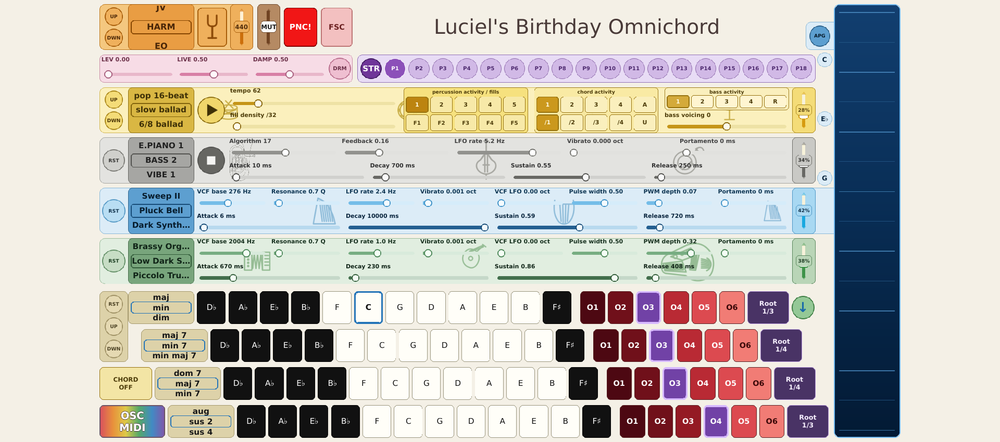
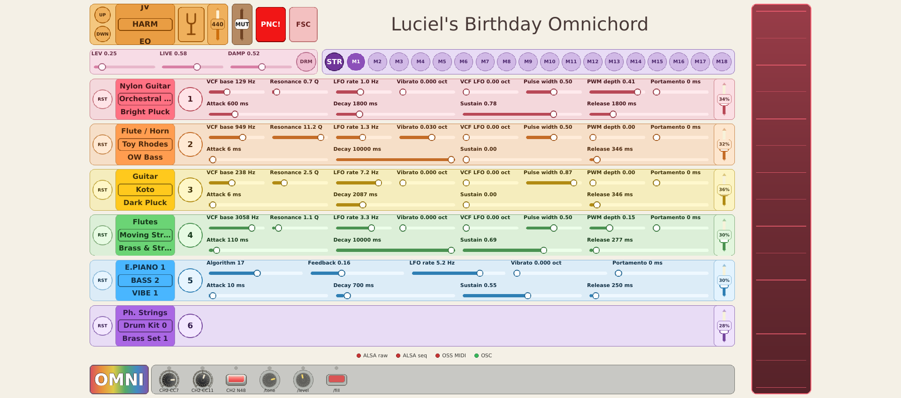

# LB Omnichord

**LB Omnichord** is a touch-first electronic chord instrument inspired by the
classic Omnichord idea: select chords with one hand, then play or strum them
with the other. It is not a software copy of a particular Suzuki instrument;
it expands the concept with independent synth voices, bass, rhythms, presets,
tuning systems, effects and MIDI control.

The actively maintained version uses a Qt Quick/PySide6 interface and the
[LB Omnichord AMY fork](https://github.com/linuxificator/amy), derived from the
[AMY (amysynth)](https://github.com/shorepine/amy) sound engine. The supported
fork is pinned for builds and native tests. The interface sends AMY wire
commands to either a separate local synth service or an ESP32-P4 hardware
target.

Originally created as a birthday gift for Luciel.

## OMNI performance screen

The OMNI screen is the self-contained instrument: choose and voice chords,
play the strum surface, build rhythms, and shape the independent bass, strum
and chord synths. Its current header combines tuning, independent master
volume, reverb and presets; the blue note markers beside the strum surface show
the musically spelled tones available to the active chord.

## MIDI performance screen

The MIDI screen provides six configurable parts with their own instrument,
synthesis controls, volume, reverb and master output. Incoming MIDI can play
the AMY instruments. MIDI learn can bind CC knobs, pitch-bend encoders and
CC-style controller buttons directly to continuous parameters and supported
button actions on both screens. Musical Note On/Off events remain note input,
not button-learn sources. The grey lower bar shows live F06-style controls for
the MIDI sources being moved or pressed.

## Get started

- [Install and run the Qt/AMY application](./amysynth_version/qt_frontend/INSTALL.md)
- [Read the active AMY implementation overview](./amysynth_version/README.md)
- [Browse the design documentation](./amysynth_version/design/README.md)
- [Download packaged releases](https://github.com/linuxificator/LB_Omnichord/releases)
- [Read the native Windows architecture and status](./amysynth_version/qt_frontend/docs/WINDOWS_NATIVE.md)

The original Sonic Pi implementation is retained as
[historical code](./rpi_sonic_pi_version) and is no longer the active version.
