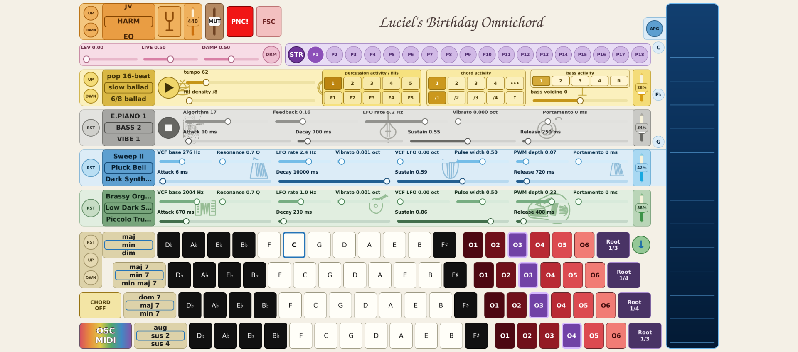

# LB Omnichord — SuperCollider edition

This directory contains the independent SuperCollider implementation of LB
Omnichord. It keeps the same Qt Quick instrument and musical catalogues as the
AMY edition, while moving synthesis, sample playback, voice ownership, mixing
and musical timing into a separately supervised headless `sclang`/`scsynth`
runtime.

The current supported target is Linux x86_64. Raspberry Pi, macOS, Windows,
Android and ESP32-P4 remain targets of the AMY edition; this directory does
not claim SuperCollider support for them yet.



## Architecture

The production boundary is a typed, versioned OSC protocol over loopback:

```text
Qt UI and policy -> immutable typed plans -> SuperCollider client
                 -> headless sclang coordinator -> scsynth audio graph
```

Python owns user interaction, catalogues and immutable plan compilation.
SuperCollider owns the clock, sequencing, note lifetimes and audio. The UI
does not schedule musical events and does not import or run AMY. The launcher
owns one SC process group and shuts it down with the frontend.

## Run from source on Linux

Install Python dependencies and SuperCollider, install the distribution's
PipeWire JACK compatibility package when PipeWire is active, and unpack VSCO
2 Community Edition at `~/sample_lib/VSCO-2-CE-1.1.0`. Then run:

```bash
cd sc_version/qt_frontend
./run_local.sh --windowed
```

The launcher deliberately refuses to start raw JACK on a PipeWire desktop
when `pw-jack` is unavailable, because raw JACK can take ownership of the
audio device. Override that safety check only for a deliberately configured
JACK system.

Configuration is read from `qt_frontend/config/supercollider.json`. The VSCO
root may use `~`; the application validates the configuration and waits for
the dedicated VSCO percussion sample program before reporting the engine ready.

## Tests and packages

Run the local test matrix from `qt_frontend`:

```bash
python tests/run_tests.py --list
python tests/run_tests.py --suite sc-frontend
python tests/run_tests.py --suite sc-compiler
python tests/run_tests.py --suite sc-sequencer
python tests/run_tests.py --suite sc-audio
python tests/run_tests.py --suite sc-banks
```

GitHub builds the Linux package independently in
`supercollider-linux.yml`. A push tests and uploads a short-lived artifact;
publishing a release requires a manual workflow run with `release=true` and
uses an `R<UTC timestamp>-SC` tag. The VSCO recordings are not bundled and
must be installed separately under their own CC0 license.

See [the SC design status](./design/sc/STATUS.md),
[the design index](./design/README.md), and
[the frontend README](./qt_frontend/README.md) for exact scope and known gaps.
