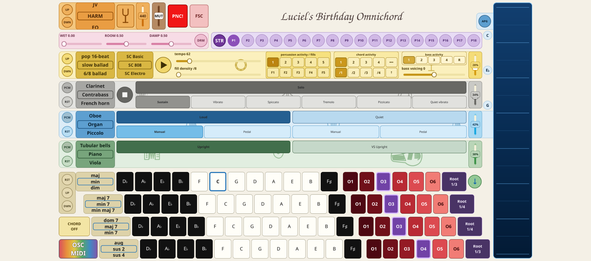

# LB Omnichord — SuperCollider edition

This directory contains the independent SuperCollider implementation of LB
Omnichord. It keeps the same Qt Quick instrument and musical catalogues as the
AMY edition, while moving synthesis, sample playback, voice ownership, mixing
and musical timing into a separately supervised headless `sclang`/`supernova`
runtime.

The packaged targets are Linux x86_64, Raspberry Pi aarch64, macOS arm64 and
Windows x86_64. Android is not yet a SuperCollider-edition target. The former
AMY and Sonic Pi editions are retained as source archives, not released
products.



## Architecture

The production boundary is a typed, versioned OSC protocol over loopback:

```text
Qt UI and policy -> immutable typed plans -> SuperCollider client
                 -> headless sclang coordinator -> Supernova audio graph
```

Python owns user interaction, catalogues and immutable plan compilation.
SuperCollider owns the clock, sequencing, note lifetimes and audio. The UI
does not schedule musical events and does not import or run AMY. The launcher
owns one SC process group and shuts it down with the frontend.
Independent source, mix and effect nodes run in parallel groups; ordering is
retained between those stages and within each dependent voice chain.

## Run from source on Linux

Install Python dependencies and SuperCollider and install the distribution's
PipeWire JACK compatibility package when PipeWire is active. Then run:

```bash
cd sc_version/qt_frontend
./run_local.sh --windowed
```

The launcher deliberately refuses to start raw JACK on a PipeWire desktop
when `pw-jack` is unavailable, because raw JACK can take ownership of the
audio device. Override that safety check only for a deliberately configured
JACK system.

On first launch a standard Qt directory chooser asks for the parent of the
sample library. The bundled Dulwich Git client then shallow-clones the pinned
`linuxificator/VSCO-2-CE` runtime branch there, and records the exact location
in `~/.omnichord/config/supercollider.json`. A script may instead pass
`--sample-root /exact/library/path`. It downloads
only the 2,166 recordings reachable from playable mappings; no system Git or
repository history is required. An existing ordinary copy is also supported.
The application compares the checked-in required-path JSON semantically with
the receipt beside the library and checks that every listed file exists; it
does not hash recordings during startup. The pinned Git commit establishes
the contents of downloads. The application waits for the
dedicated VSCO percussion sample program before reporting the engine ready.

## Tests and packages

Run the local test matrix from `qt_frontend`:

```bash
python tests/run_tests.py --list
python tests/run_tests.py --suite sc-frontend
python tests/run_tests.py --suite sc-compiler
python tests/run_tests.py --suite sc-sequencer
python tests/run_tests.py --suite sc-audio
python tests/run_tests.py --suite sc-banks
```

The `supercollider-release.yml` workflow tests the four supported platforms on
ordinary pushes. It builds and publishes packages only when manually dispatched
with `release=true`, using an `R<UTC timestamp>-SC` tag. The VSCO recordings are
not bundled; first launch obtains them under their separate CC0 license.

See [the SC design status](./design/sc/STATUS.md),
[the design index](./design/README.md), and
[the frontend README](./qt_frontend/README.md) for exact scope and known gaps.
